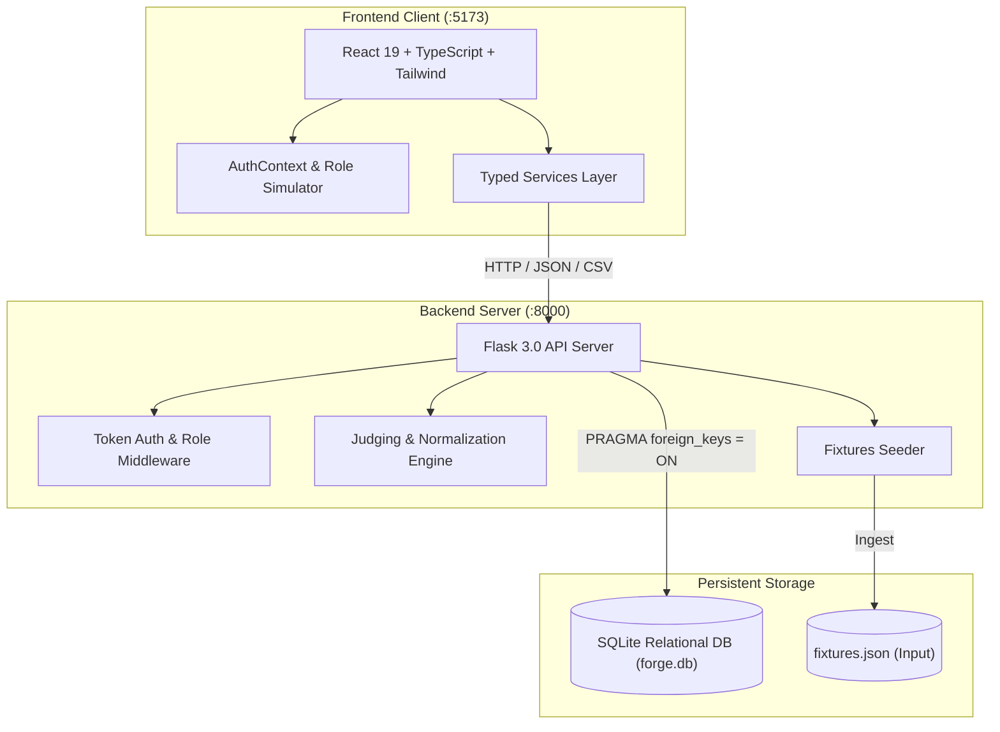

# Forge Architecture Specification

Forge is an open-source, self-hostable platform for hackathon submissions and judging built for DOGFOOD 2026. This document details the technical architecture, data flows, and security model.

---

## 1. High-Level Architecture Overview

---

## 2. Frontend Architecture (`/frontend`)

- **Framework**: React 19 + TypeScript bundled via Vite 8.
- **Styling**: Tailwind CSS v4 using a classic, minimal, technical dark zinc palette.
- **Design Philosophy**: Zero emojis, zero cartoon decorative assets, clear typography, responsive tables, robust loading/empty/error states.
- **Service Isolation**: Reusable components (`ProjectCard`, `RubricCriterionCard`, `PageHeader`, `Table`, `Modal`, `RoleGuard`) never perform ad-hoc fetch calls. All API traffic passes through typed services (`authService`, `projectService`, `teamService`, `judgeService`, `organizerService`) backed by `apiClient`.
- **Role Awareness**: The client includes dynamic route guards for 5 roles (`visitor`, `participant`, `judge`, `organizer`, `admin`) and a live header role switcher that attaches real seeded tokens to inspect any role's experience immediately.

---

## 3. Backend Architecture (`/backend`)

- **Framework**: Python 3.12 + Flask.
- **Design Principles**: Boring, stable, zero cloud dependencies, 100% offline-capable, runs anywhere with standard library modules.
- **Data Persistence**: Local SQLite relational database (`forge.db`) using strict foreign keys (`PRAGMA foreign_keys = ON;`) and explicit table constraints.
- **API Structure**:
  - `/api/auth/*`: Authentication, session verification, credential issuance.
  - `/api/projects` & `/api/projects/:id`: Public unauthenticated project gallery and specifications.
  - `/api/participant/*`: Project creation, draft iteration, submission, and team formation.
  - `/api/judge/*`: Project assignment queues, dynamic rubric delivery, scoring, and evaluation drafts.
  - `/api/organizer/*`: Telemetry overview, judge invitation, assignment matrix, rubric editor, scoring results, and CSV streaming.

---

## 4. Authentication & Authorization Model

### Authentication
- Server-side bearer token authentication: `Authorization: Bearer <token>`.
- Stable seeded tokens provided for testing and automated checkers:
  - `organizer`: `forge_organizer_token_2026`
  - `judge_a`: `forge_judge_a_token_2026`
  - `judge_b`: `forge_judge_b_token_2026`
  - `participant`: `forge_participant_token_2026`

### Strict Backend Authorization
- Frontend role checks are purely UX affordances; **the backend is authoritative**.
- Reusable `@require_auth(roles=[...])` decorator inspects the bearer token against the `users` table and asserts role permissions.
- **Judge Score Isolation**:
  - When accessing `/api/judge/scores?judge=<id>`, the backend checks `current_user['id'] == requested_judge_id`. If Judge B attempts to view Judge A's scores, the backend responds with `403 Forbidden`.
  - Non-judges (e.g. participants) calling judge scoring endpoints receive `403 Forbidden`.
- **Submission Deadline Enforcement**:
  - The backend checks `events.submissions_close`. If the closing timestamp has elapsed or `submissions_open = 0`, any `POST /api/projects` or `POST /api/projects/:id/submit` call is rejected with `403 Forbidden` (`4xx`).
- **CSV Export**:
  - Only users with the `organizer` (or `admin`) role can trigger `/api/organizer/export/csv`. Any participant or judge receives `403 Forbidden`.

---

## 5. Docker Orchestration

The application is fully containerized via `docker-compose.yml`:
- `backend`: Runs Python 3.12 Flask server on port 8000 with a persistent named volume for `forge.db`.
- `frontend`: Builds the React TypeScript bundle and serves static assets on port 5173.
- Runs without any external internet connection, API keys, or cloud databases.
