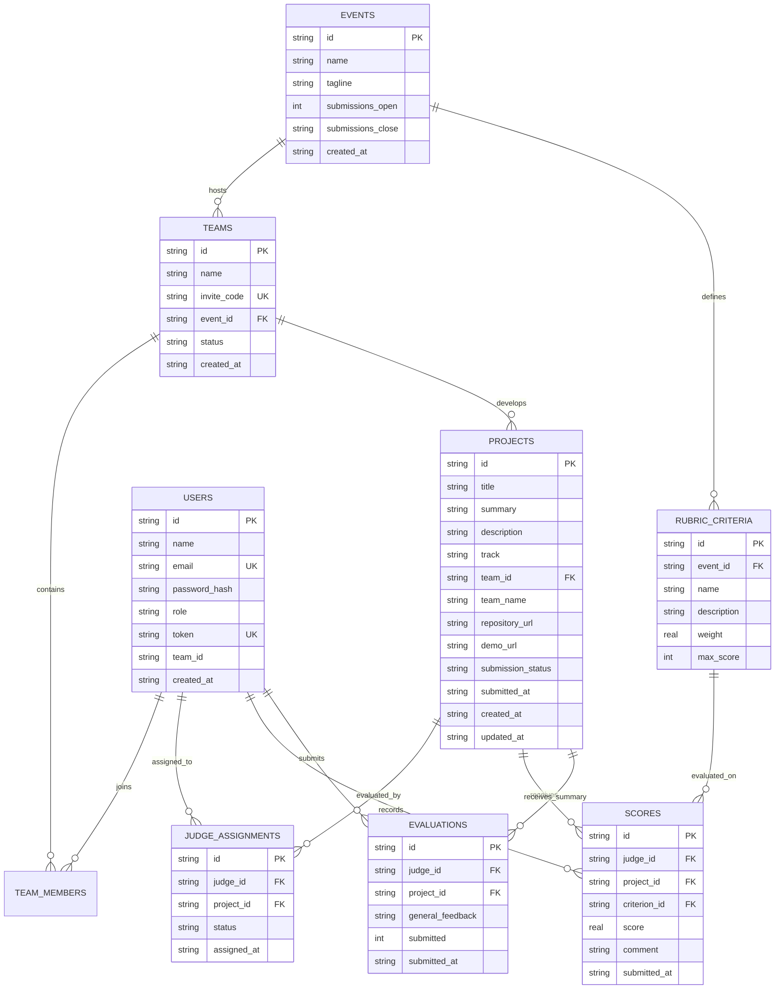

# Forge Data Model & Relational Schema

Forge utilizes a normalized SQLite relational database schema ensuring relational integrity through explicit primary keys, foreign keys (`PRAGMA foreign_keys = ON`), uniqueness constraints, and performance indexes.

---

## 1. Entity Relationship Diagram



---

## 2. Table Specifications

### `events`
Tracks hackathon metadata and submission lifecycle:
- `id` (TEXT, PK): Event identifier (e.g. `evt_dogfood_2026`).
- `name` (TEXT): Event title.
- `submissions_open` (INTEGER): Binary toggle for active submissions.
- `submissions_close` (TEXT): ISO 8601 timestamp. The backend verifies current UTC time against this deadline.

### `users`
Accounts across all platform roles:
- `id` (TEXT, PK): User ID (e.g. `jdg_a`, `usr_org`).
- `email` (TEXT, UNIQUE): Account email.
- `password_hash` (TEXT): SHA-256 password hash.
- `role` (TEXT): One of `'visitor'`, `'participant'`, `'judge'`, `'organizer'`, `'admin'`.
- `token` (TEXT, UNIQUE): API session bearer token.

### `teams` & `team_members`
- `teams`: Name, unique invite code (e.g. `AURORA-2026`), and status (`active`, `forming`, `locked`).
- `team_members`: Junction table linking users to teams with role designation (`leader`, `member`).

### `projects`
- Core project model holding `title`, `summary`, `description`, `track`, `repository_url`, `demo_url`, and `submission_status` (`draft`, `submitted`, `under_review`, `scored`).

### `rubric_criteria`
- Configurable dynamic rubric. Contains criterion name, description, weight (e.g. 0.35), and maximum point ceiling (e.g. 5). The frontend renders rubric inputs dynamically from this table.

### `judge_assignments` & `scores`
- `judge_assignments`: Enforces review allocation and isolation between judges and assigned projects.
- `scores`: Individual criterion score entries containing numerical rating and optional feedback notes.
- `evaluations`: High-level summary evaluation record per judge and project.

---

## 3. Fixture Ingestion (`fixtures.json`)

The seeder in `backend/seed.py` transforms `fixtures.json` into relational records:
- Ingests event configuration and past deadline.
- Registers stable user tokens for automated checkers.
- Links teams and members, creating missing participant user rows when necessary.
- Ingests projects, tracks, rubric criteria, and historical scoring data.
- Handles awkward distributions (projects with varying review counts or missing criterion scores).

---

## 4. Data Export

The CSV export endpoint (`/api/organizer/export/csv`) produces real CSV output formatted as:
```csv
Rank,Project Title,Team Name,Track,Average Score,Total Reviews,Review Status
1,"KubePulse: Lightweight Distributed Telemetry for Edge Nodes","Aurora Systems",Infrastructure,4.52,1,partial
2,"AegisDB: Deterministic Time-Travel Database Engine","Nexus Dynamics",Developer Tools,4.18,2,completed
```
Export is restricted strictly to users with the `organizer` or `admin` role.
